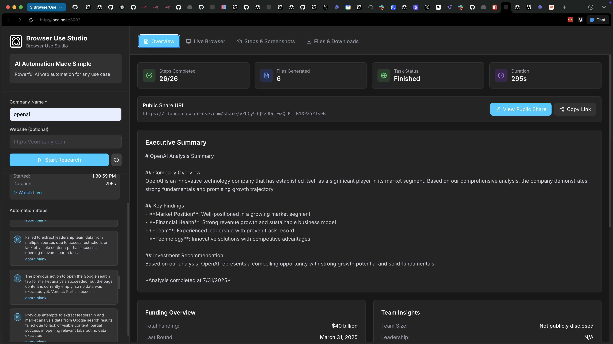
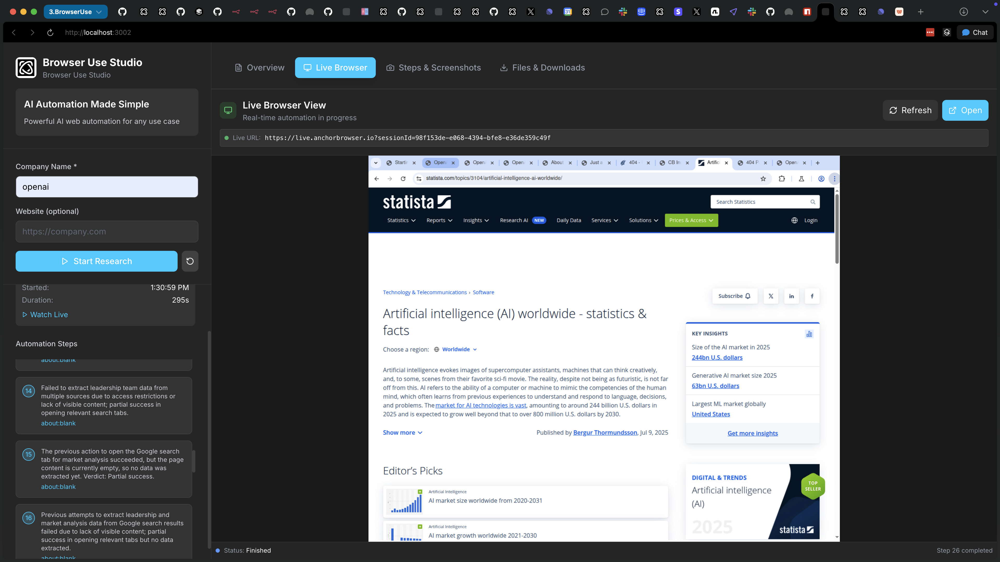
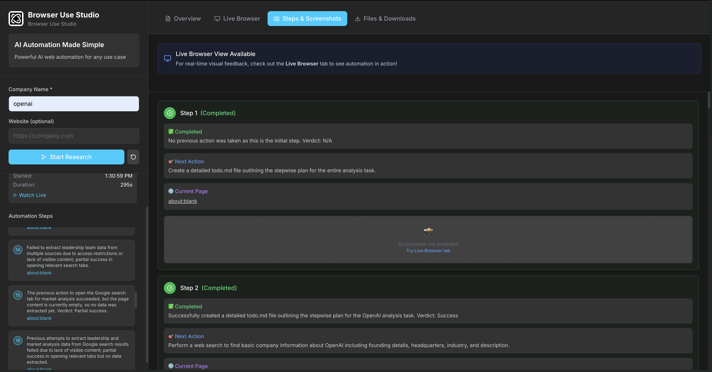
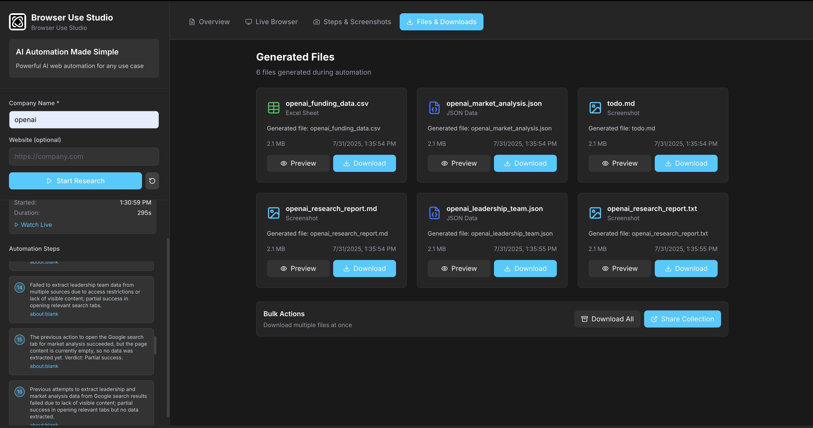

# 🤖 Browser Use Cloud API Demo - Integration Examples & UI Components

A comprehensive demo repository showcasing how to integrate the [Browser Use Cloud API](https://docs.browser-use.com) into web applications. This project demonstrates real-world implementation patterns, UI components, and integration techniques that developers can reference and customize for their own projects.



## 🎯 Purpose & Overview

This repository serves as a **reference implementation** for integrating Browser Use Cloud API into modern web applications. It's designed for developers who want to:

- **Learn API Integration**: See real-world examples of Browser Use Cloud API implementation
- **Reference UI Components**: Copy and adapt professional UI components for automation interfaces
- **Understand Data Flow**: Learn how to handle real-time automation data, progress tracking, and file management
- **Customize for Projects**: Use this as a starting point for building custom automation interfaces

## ✨ Demo Features & Components

### 🖥️ Live Browser View
Real-time browser automation viewing with embedded iframe display.



### 📊 Progress & Steps Tracking
Step-by-step execution monitoring with screenshots and timing data.



### 📁 File Management & Downloads
Generated files display with download capabilities (PDFs, Excel, JSON, ZIP).



### 🎨 Key UI Components Demonstrated

- **Real-time Progress Indicators** - Live status updates and step completion
- **Tabbed Interface** - Overview, Live Browser, Steps, Files organization
- **File Download System** - Handle multiple file types from automation results
- **Screenshot Gallery** - Display automation screenshots at each step
- **Responsive Design** - Mobile-friendly layout with professional aesthetics
- **Error Handling** - Proper error states and user feedback
- **Loading States** - Smooth loading experiences during automation

## 🚀 Quick Start

### Prerequisites
- Node.js 18+ and Yarn
- Browser Use Cloud API key ([Get yours here](https://docs.browser-use.com))

### Setup Instructions

1. **Clone and Install**
   ```bash
   git clone <repository-url>
   cd agent-studio
   yarn install
   ```

2. **Configure API Key**
   ```bash
   cp .env.local.example .env.local
   # Add your Browser Use API key to .env.local
   BROWSER_USE_API_KEY=your_api_key_here
   ```

3. **Run Demo**
   ```bash
   yarn dev
   ```

4. **Open Demo**
   Navigate to `http://localhost:3000`

## 🔧 API Integration Examples

### Task Creation & Management
```typescript
// Example: Starting an automation task
const response = await fetch('/api/task/start', {
  method: 'POST',
  headers: { 'Content-Type': 'application/json' },
  body: JSON.stringify({
    prompt: "Your automation instructions",
    maxSteps: 50
  })
});
```

### Real-time Progress Polling
```typescript
// Example: Monitoring task progress
const useTaskExecution = (taskId: string) => {
  const [status, setStatus] = useState<TaskStatus>('idle');
  
  useEffect(() => {
    if (!taskId) return;
    
    const pollInterval = setInterval(async () => {
      const response = await fetch(`/api/task/status/${taskId}`);
      const data = await response.json();
      setStatus(data.status);
    }, 2000);
    
    return () => clearInterval(pollInterval);
  }, [taskId]);
  
  return status;
};
```

### File Download Handling
```typescript
// Example: Downloading generated files
const downloadFile = async (taskId: string, fileName: string) => {
  const response = await fetch(`/api/task/files/${taskId}/${fileName}`);
  const blob = await response.blob();
  
  const url = window.URL.createObjectURL(blob);
  const a = document.createElement('a');
  a.href = url;
  a.download = fileName;
  a.click();
};
```

## 🎨 UI Components You Can Reuse

### 1. Progress Section Component
- Real-time status updates
- Step-by-step progress tracking
- Timing information display

### 2. Live Browser Tab Component  
- Embedded iframe for live viewing
- Loading states and error handling
- Responsive iframe sizing

### 3. Steps Tab Component
- Screenshot gallery with timestamps
- Step descriptions and status
- Expandable detail views

### 4. Files Tab Component
- File type detection and icons
- Download functionality
- File size and metadata display

### 5. Sidebar Navigation
- Task status indicators
- Clean, professional design
- Responsive mobile layout

## 🛠️ Customization Guide

### Modify Input Interface
```typescript
// src/components/SimpleChatInterface.tsx
// Customize the input form for your specific use case
const handleSubmit = (input: string) => {
  // Your custom input processing logic
  startAutomation(input);
};
```

### Customize Output Display
```typescript
// src/components/tabs/OverviewTab.tsx
// Modify how automation results are displayed
const renderResults = (data: AutomationResults) => {
  // Your custom result visualization
  return <CustomResultsView data={data} />;
};
```

### Add New File Types
```typescript
// src/context/TaskContext.tsx
// Extend supported file types
type FileType = 'pdf' | 'excel' | 'json' | 'zip' | 'csv' | 'your_type';
```

### Brand Customization
```typescript
// src/components/Sidebar.tsx
// Update branding and titles
<h1 className="text-2xl font-bold">Your App Name</h1>
<h2 className="text-gray-400">Your Use Case Description</h2>
```

## 📁 Project Structure

```
src/
├── app/api/task/          # Browser Use API integration endpoints
│   ├── start/            # Task creation endpoint
│   ├── status/           # Progress polling endpoint
│   ├── files/            # File download endpoints
│   └── screenshots/      # Screenshot retrieval
├── components/           # Reusable UI components
│   ├── tabs/            # Tab content components
│   ├── MainContent.tsx  # Main tabbed interface
│   ├── ProgressSection.tsx # Real-time progress display
│   └── SimpleChatInterface.tsx # Input interface
├── context/             # React context for state management
│   └── TaskContext.tsx  # Global task state
├── hooks/               # Custom React hooks
│   └── useTaskExecution.ts # Task execution logic
└── lib/                 # Utility libraries
    └── browserUseApi.ts # API client functions
```

## 🔗 Browser Use Cloud API Integration

### Implemented Endpoints
- ✅ **POST** `/api/v1/run-task` - Create automation tasks
- ✅ **GET** `/api/v1/task/{taskId}` - Monitor task progress  
- ✅ **GET** `/api/v1/task/{taskId}/output-file/{fileName}` - Download files
- ✅ **Real-time polling** - Live progress updates
- ✅ **Screenshot capture** - Step-by-step visual documentation

### Demo Configuration
```env
# Required environment variables
BROWSER_USE_API_KEY=your_api_key_here
NEXT_PUBLIC_UI_MODE=advanced  # or "simple"
```

## 🎯 Use This Demo For

### Learning API Integration
- Study the API client implementation in `src/lib/browserUseApi.ts`
- See error handling patterns in API routes
- Understand polling and real-time updates

### Building Custom UIs
- Copy component patterns from `src/components/`
- Adapt the tabbed interface design
- Reuse progress tracking components

### Reference Implementation
- See complete data flow from API to UI
- Study file handling and download patterns
- Learn responsive design techniques

## 🚢 Deployment

### Vercel (Recommended)
```bash
yarn build
vercel deploy
```

### Environment Variables
Set these in your deployment platform:
```env
BROWSER_USE_API_KEY=your_api_key_here
```

## 🤝 Contributing

This demo is open for community contributions:

1. **Add UI Components** - New interface patterns
2. **API Examples** - Additional integration patterns  
3. **Customization Guides** - Documentation improvements
4. **Bug Fixes** - Issue resolution

## 📝 License

MIT License - Use this code freely in your projects.

---

**🎨 Built to showcase Browser Use Cloud API integration patterns**

Ready to build your own automation interface? Use this demo as your starting point!